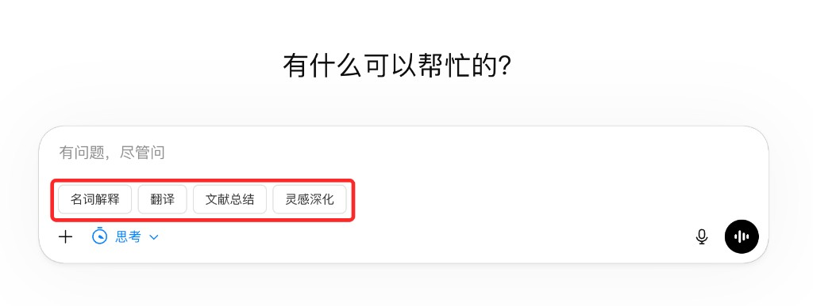

# BulletChat

AI Prompt Shortcuts for LLMs

BulletChat is a Chrome extension built with Manifest V3. It adds a row of prompt shortcut buttons next to the chat input on supported LLM websites, so you can insert reusable prompts with one click.

## Features

- Adds one-click prompt shortcut buttons next to the chat input.
- Lets you save and manage your own reusable prompt templates.
- Works across multiple LLM websites with a consistent experience.
- Stores your prompt templates locally with `chrome.storage.local`.
- Ships as a lightweight unpacked Chrome extension that can be loaded directly from `dist/`.

## Supported Sites

- ChatGPT
- Gemini
- Doubao
- Qianwen / Tongyi
- Kimi

## Installation

1. Open `chrome://extensions/` in Chrome.
2. Turn on `Developer mode`.
3. Click `Load unpacked`.
4. Select the `BulletChat/dist` folder.
5. Open a supported chat website.

## How to Use

1. Click the BulletChat extension icon to open the prompt manager.
2. Add a new shortcut with a label and the prompt text you want to reuse.
3. Save your changes.
4. Go to a supported LLM site and click one of the shortcut buttons near the input box.
5. The selected prompt will be inserted into the current chat input so you can edit or send it.

## Prompt Management

- Create multiple prompt shortcuts for common tasks.
- Edit labels and prompt text at any time.
- Delete shortcuts you no longer need.
- Your saved prompts stay local in the browser.

## Known Issues

- On Qianwen, inserting a preset prompt may add two leading blank lines. This does not affect normal usage.
